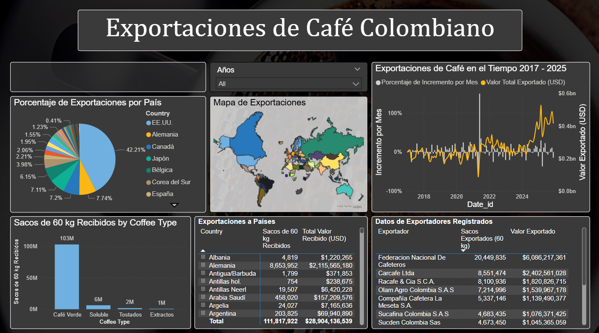

# ☕ Dashboard de Exportaciones de Café Colombiano (Power BI)

Un proyecto de análisis de datos de extremo a extremo que explora la **dinámica de las exportaciones de café colombiano** mediante un dashboard interactivo en Power BI, construido utilizando la estructura `.pbip` para control de versiones.

Este proyecto demuestra un flujo completo: desde datos en bruto en Excel hasta un modelo estructurado y un reporte interactivo.

---

## 📊 Descripción del Proyecto

Colombia es uno de los principales exportadores de café a nivel mundial. Este proyecto analiza datos de exportación para identificar:

* Tendencias de exportación en el tiempo
* Principales mercados de destino
* Distribución de exportaciones por puerto
* Patrones en volumen y logística

El objetivo principal es mostrar cómo los **datos operacionales en bruto** pueden transformarse en **insights de negocio** utilizando Power BI. Adicionalmente, se desea que proporcionar un informe basado en información oficial para dimensionar la capacidad de exportaciones de café Colombiano.

---

## 🏗️ Arquitectura y Flujo de Trabajo

Este proyecto sigue un flujo moderno de analítica de datos:

1. **Fuentes de Datos**

   * Archivos Excel con registros de exportaciones
   * Datos de referencia de localización de puertos

2. **Transformación de Datos (Power Query)**

   * Limpieza y normalización de datos
   * Estandarización de columnas
   * Manejo de valores faltantes
   * Integración de datasets (exportaciones + puertos)

3. **Modelado de Datos**

   * Modelo relacional entre exportaciones y ubicaciones
   * Estructura optimizada para análisis

4. **Capa de Visualización (Power BI)**

   * Dashboards interactivos
   * Filtros y segmentadores
   * KPIs agregados

---

## 📂 Estructura del Proyecto

```
ColombianCoffee-main/
│
├── ColombianCoffeeExportations.pbip   # Proyecto Power BI (compatible con Git)
│
├── ColombianCoffeeExportations.Report/
│   ├── definition/                    # Definición del reporte (JSON)
│   ├── pages/                         # Páginas del dashboard
│   └── StaticResources/               # Temas y recursos visuales
│
├── *.xlsx                             # Fuentes de datos
│   ├── Exportaciones-2025-1.xlsx
│   ├── ExportacionesSource.xlsx
│   └── ports_location.xlsx
│
├── exportacionesPreview.png           # Vista previa del dashboard
├── Background.png / .pptx             # Recursos visuales
│
└── README.md
```

---

## 📈 Características del Dashboard

El reporte en Power BI permite:

* 📦 Análisis de **volúmenes de exportación**
* 🌎 Identificación de **principales destinos**
* 🚢 Análisis por **puertos de salida**
* 📅 Análisis temporal de tendencias
* 🎯 Filtrado interactivo por múltiples dimensiones

---

## 🖼️ Vista Previa del Dashboard



---

## 📚 Fuente de Datos

Los datos utilizados en este proyecto provienen de los reportes oficiales publicados por la
**Federación Nacional de Cafeteros de Colombia**.

* Fuente:
  https://federaciondecafeteros.org/wp/estadisticas-cafeteras/

Estos reportes contienen estadísticas detalladas sobre producción, exportaciones y comercialización del café en Colombia.

Los datasets incluidos en este repositorio han sido derivados y adaptados a partir de estas fuentes oficiales con fines analíticos y educativos.

---

## ⚙️ Cómo Usarlo

1. Clona el repositorio:

   ```
   git clone https://github.com/SantiOrtizQ/ColombianCoffee.git
   ```

2. Abre el archivo `.pbip` en **Power BI Desktop**

3. Si es necesario:

   * Actualiza las rutas de los archivos Excel
   * Refresca el modelo de datos

4. Explora el dashboard de forma interactiva

---

## 🧠 Habilidades y Aprendizajes Demostrados

* Uso de proyectos Power BI con `.pbip` (compatibles con control de versiones)
* Transformación de datos con **Power Query (M)**
* Modelado de datos y relaciones
* Diseño de dashboards y storytelling
* Trabajo con datasets reales de exportaciones

---

## 🚀 Posibles Mejoras

* Automatizar la ingesta de datos (API o base de datos)
* Incorporar medidas DAX avanzadas (crecimiento interanual, promedios móviles)
* Mejorar visualizaciones geoespaciales
* Desplegar en Power BI Service

---

## 👤 Autor

**Santiago Ortiz**
Ingeniero Físico | Analítica de Datos | Ingeniería de Datos

GitHub:
https://github.com/SantiOrtizQ

---

## 📌 Notas

* Este proyecto utiliza archivos Excel locales como fuente de datos
* No incluye información sensible
* Diseñado con fines educativos, demostrativos y de portafolio

---
